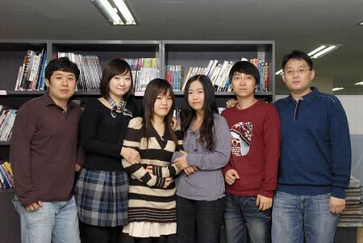

## 《冲锋岛》开发队Symmetric space访谈 

就在几天前，由韩国著名游戏开发商Symmetric space倾力打造2D横版MMORPG——《冲锋岛》正式登录中国市场了。作为一款全新概念的2D横版网游，初次现身，《冲锋岛》便凭借着堪称完美的绚丽画面、丰富多彩的游戏系统，以及别具一格的创新理念，吸引了无数国内玩家关注的目光。虽说此刻《冲锋岛》还未正式进入测试阶段，不过，为了让广大对《冲锋岛》充满期待的玩家朋友们，能够更全面、更深入的了解《冲锋岛》的奇妙世界，近日，我们有幸约见了《冲锋岛》的韩方开发团队：Symmetric space，并就各种与游戏相关的问题，向开发队进行了一次深入而愉快的采访。那么现在，就让我们一起来看看吧！

### Q1. 世界观
通过游戏介绍，我们了解到《冲锋岛》的世界是由多个风格不同的岛屿所组成的。那么，最初是什么样的想法促成了现在这款游戏充满幻想风格的世界观的呢？

关键字：宇宙  行星  岛  基地

Symmetric space：其实《冲锋岛》的基本情节是以宇宙为背景展开的。但以“宇宙”为大背景的话，便会牵涉到行星、星云等比较复杂的概念，因此，我们便将它设定成比较符合故事情节的“岛”的概念。换句话说，在《冲锋岛》的世界里，一个“岛”便代表了一个行星。而在游戏里，三个不同的种族本身就存在较大的差异并且居住在不同的行星（岛）上，所以我们决定把各个种族生活的基地也进行差别化后再展现给玩家。这样一来，我们要做的事情也多出了3倍。（笑）^ ^

### Q2. 原画师
我们注意到，《冲锋岛》的人物以及怪物原画都是特别可爱的，是否能为我们介绍下这款游戏的原画担当？

关键字：电子机  漫画  可爱  攻击性

Symmetric space：《冲锋岛》的原画担当是位做事非常专注、非常喜欢画画的男生。他喜欢手机、PDA等小型电子机件，也喜欢看日本漫画和动画片等等，本人是个留着小寸头的29岁娃娃脸男生（笑）。其实仔细观察他的画你就会发现，除了可爱的元素外，他的画有时候也会显示出一种攻击性，所以说，在他的画里掺杂着很多他自己的兴趣喜好。

### Q3. 冒险岛
包括日本在内的多个海外游戏媒体，都曾将《冲锋岛》比喻为“继承冒险岛血脉的游戏”，对此您又是如何理解的？

关键字：系出同门  横版卷轴式MMORPG  完整形态

Symmetric space：我们并不认为《冲锋岛》是继承《冒险岛》而制作的游戏。最初，当游戏企划将《冲锋岛》定为RPG游戏后，我们才决定要将以前在制作《冒险岛》时没能在技术、策划中实现的部分，都投射入《冲锋岛》的世界里，使其成为更具完整形态的横版卷轴式MMORPG游戏。或许从旁人的角度看，会觉得《冲锋岛》的核心开发者是由开发《冒险岛》的主要成员组成，所以这两款游戏存在着一定的相似度。不过作为游戏开发者，我们并不希望玩家有对比的念头，而只更希望玩家能够自然的陷入其中，并单纯的享受《冲锋岛》带来的魅力与乐趣。

### Q4. 飞行
根据我们目前所了解的资料，《冲锋岛》将会在“飞行”这一系统上有着让人耳目一新的表现，能在这里先给我们介绍下吗？
　　  
关键字：梦想  飞行  PvP  中国玩家

Symmetric space：人类从很久以前便一直向往着能像鸟儿一样翱翔在天空，而如今虽说在现实世界里早已实现了飞行的梦想，不过飞翔还是受到很多条件的限制。所以我们觉得，如果能在虚拟的游戏世界中自由自在的飞行，那一定会是件很快乐的事。

此外，在《冲锋岛》的横向世界里，空中飞行不但使移动变得更为轻松，同时也将使PvP及Boss战中的移动范围变得更为广泛。话虽如此，不过我们开发飞行系统最主要的目的，还是建立在给玩家带去更多快乐的想法上。所以在未来，我们也将继续努力增加这方面的活动策划。当然了，随着《冲锋岛》进入中国，我们也将倾听广大中国玩家的想法，为了创造一个更加有趣、更加丰富的《冲锋岛》世界而努力，也期待中国玩家能够踊跃参与其中喽（笑^ ^）。

### Q5. 技能
在游戏的角色发展上，《冲锋岛》的各个种族拥有多个可供选择的技能分支，这样的设置初衷是什么？玩家们该如何才能寻找到更正确的选择其角色发展的技能方向？

关键字：种族  天赋  技能  角色类型  觉醒

Symmetric space：在《冲锋岛》的世界里有着人类、精灵、龙人三个种族，同时每个种族又被细分为2到3个不同的类型。比如，人类可分为：使用近战武器的战士型以及使用远距离武器的Ranger型。精灵可分为：身形敏捷、善于快攻的刺客型或使用黑魔法、咒语的Debuffer型。而喜欢魔法的玩家，则可以选择擅长使用冰、火、光等魔法的龙人族。值得一提的是，这种类型的区分便是根据分配技能图表中的技能点数来决定的，当然了，根据技能点数的分配，玩家也可以按照自己的喜好培养出混杂类型的角色。

此外，在这样一种选择种族、分配技能点数的过程中，玩家们肯定也会想要寻找最有效的使用能力和技能点数的方式。所以，考虑到可能各种族中会出现类别单一化的情况，为此，我们也特别开发了“觉醒”系统，使玩家们的角色类型得以更加细分化。相信这个系统也一定能让玩家们领悟到《冲锋岛》的多种魅力。

### Q6. 种族
能否介绍下三个种族和他们守护者的最初构思灵感都是来源于哪些东西吗？对于如此有趣的设定，相信玩家都会十分感兴趣。

关键字：灵感  梦想  守护者

Symmetric space：我想，从小看着漫画或是科幻电影长大的朋友，都曾有过类似操纵机器人打倒恶势力，乘着巨龙飞翔天空，或是像蝙蝠侠、超人、蛛蛛侠一样拥特殊能力，能在变身后获得强大力量来拯救世界的梦想。而在策划《冲锋岛》时，我们也突发奇想，觉得如果能将这样的梦想展现在游戏里的话，不是会很有意思么？于是，“守护者”的概念便这样产生了。之后，考虑到三个种族在外形和特性上都有所不同，所以我们也发出三种不同的守护者，相信这各具特色的守护者一定能给大家带来更多趣味与惊喜。

### Q7. 发展
既然《冲锋岛》现在即将在中国正式运营，那么是否可以展望一下未来在中国大陆的发展？比如游戏的本地化特色更新等等。

关键字：中国市场&中国玩家  本土化  中国场景地图

Symmetric space：我们认为中国的网游市场是非常广阔且多元化的，同时，游戏玩家的数量也是韩国的数十倍。因此，考虑到中国玩家在文化、兴趣方面的多样性，我们也已为《冲锋岛》制定了各种符合不同玩家口味的社团化技能游戏系统。而在未来，随着《冲锋岛》的日趋完善，我们也将为游戏的本土化付出更多努力。届时，游戏里会出现更多具有中国特色的道具，并开放更多与之相关的活动等等。如果在2009年内，中国场景地图能够制作完成的话，那就最好不过吧？总之，我们会认真听取中国玩家的各种意见和想法，并为了《冲锋岛》的中国本土化不断努力，希望大家都支持我们吧（笑^  ^）。

### Q8. 特色
像《冒险岛》这一类型的游戏，在中国有着非常广泛的年龄层，您认为《冲锋岛》最能吸引那些20多岁的“大孩子”的特色是什么呢？

关键字：全年龄  享受  副本  PK  飞行  操控力  3D形态BOSS

Symmetric space：我们认为，《冲锋岛》比较适合年龄相对不大的孩子，以及没有什么负担能够好好享受游戏的人们。当然了，想充分体验《冲锋岛》魅力的玩家们，就一定不能错过活动、副本、PvP及战场等系统。不过，要充分享受这部分乐趣的玩家，就必须拥有敏捷的操控力及攻略的支持了。

《冲锋岛》的副本系统，与以往的2D横版卷轴式游戏有着诸多不同点。通过副本，玩家们可以挑战3D形态的怪物Boss，并从它们那里获得各种高等级的极品道具。当然，这些怪物BOSS是非常强大的，玩家们必须以团队的力量齐心协力才能击败它们。而每个副本的难度也被分为4个不同的阶段，即：普通、困难、专家、达人，以满足各种玩家的不同需求，其中有些副本也会对玩家的种族或角色类型有一定的要求。

同时，《冲锋岛》也拥有支持玩家之间对战的PK系统。除了1:1PK外，《冲锋岛》还拥有能够使所有玩家都化成敌人的“无限制竞技场”系统。届时，除了4:4进行的多玩家“战场”外，更有8:8进行的“公会战”等。

另外，过去的2D横版卷轴式游戏只有在直线上左右移动或跳跃等的操作方式，这种单一的移动方式也令游戏的多样性大打折扣。不过，在《冲锋岛》里我们却可以翱翔天空，并利用跳板等物体，实现动态的躲避或追逐对方的效果。所以，对游戏的理解力、分析力更强的20岁左右的年轻玩家，便应该会更加喜欢这种需要控制和战略思维的大型对战活动。而在未来，我们也将就战场的多样性，做出更多的创新与改革。

---

> 2008-12-11 [源地址](http://news.17173.com/content/2008-12-11/20081211114236163,1.shtml)
